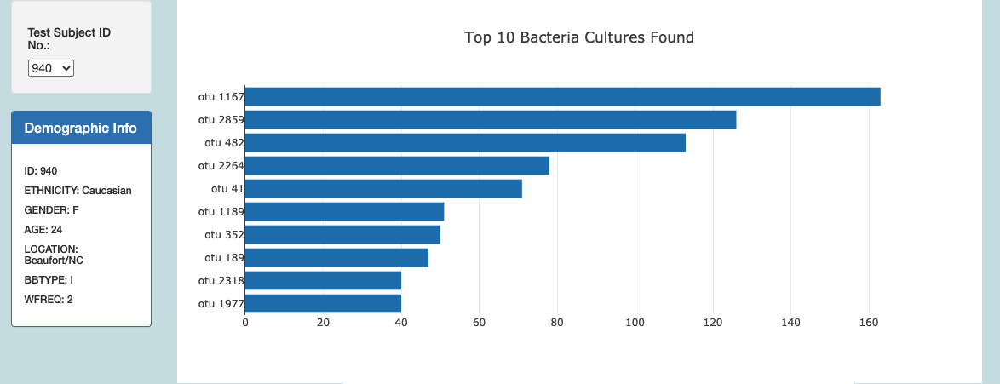
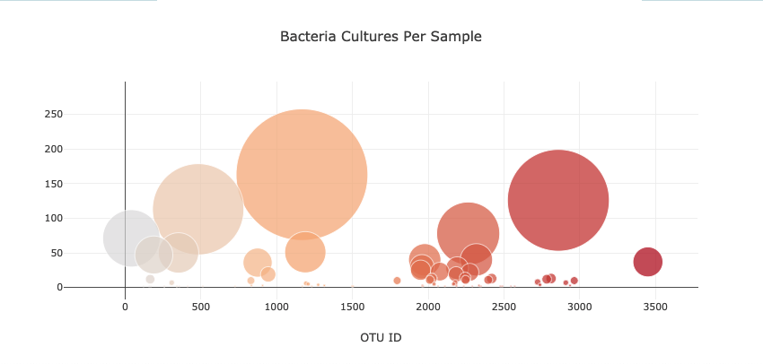
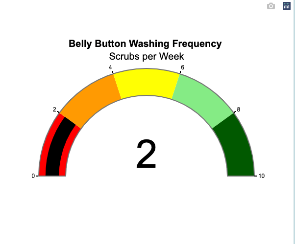
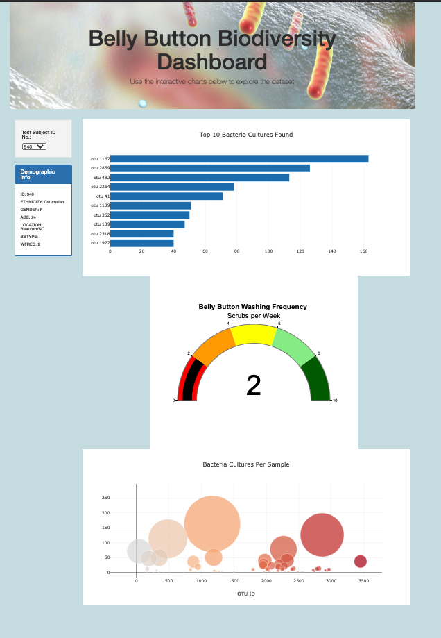

# plotly_deploy

## Introduction
The purpose of the challenge associated with this repository was to create a a dashboard for our client Roza that gave visuals to what bateria and how much of it is found in a bellybutton based off of numerous samples from volunteers and how often they washed their belly buttons in one week.

## Summary
This dashboard is dynamic in a way that at each selection of a volunteer, the dashboard gives the visualized data of the bacteria of that volunteer. In this analysis we provided the following:

  - Horizontal bar Chart:
  
    

  - Bubble Chart:

    

  - Gauge Chart:
 
    

  - Official Customized Dashboard:
  
    

To finish off this dashboard, instead of three, I made four cosmetic bootstrap changes were made:
  1. Made sure that the dashboard was mobile-responsive
  2. Change the background color of the dashboard
  3. Added a photo to the jumbotron
  4. Lastly, as an extra, adjusted the placement of each graph to be primarily vertically centered beneath the bar chart

## Conclusion
In conclusion, to utilize this dashboard, just select a test subject number in the filter besides the bar chart and the results will deliver a customize dashboard of all three charts of a bar, bubble, and gauge chart, as well as the demographic information of this designated volunteer. From the information provided, you be able to find what bacteria and how much of them are found in the belly button!
